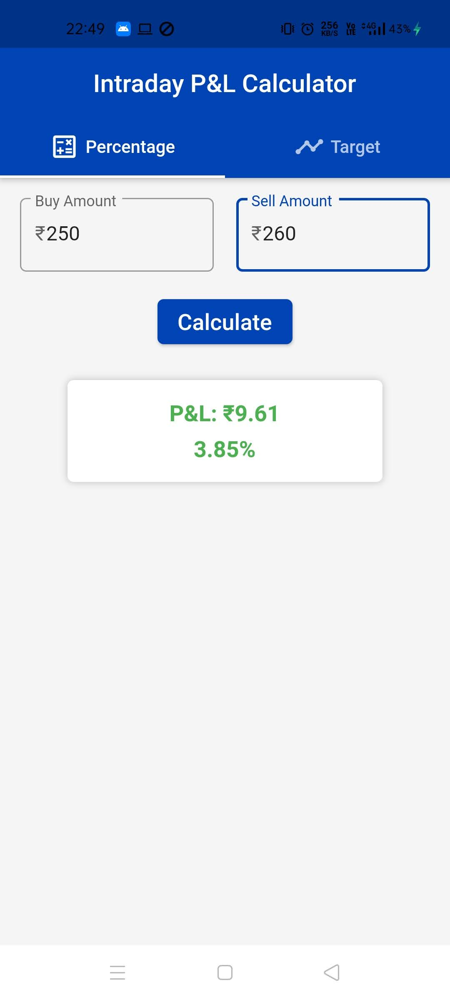
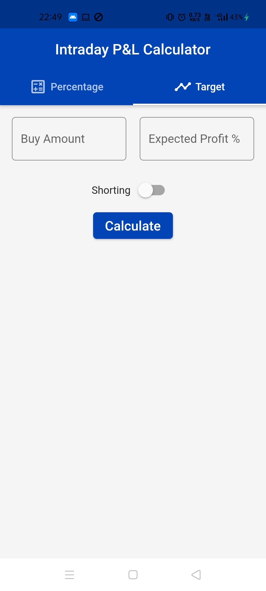
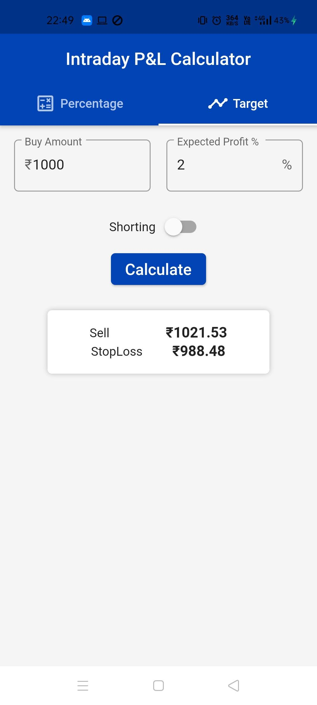

# Intraday P&L Calculator for Upstox

## Screenshots:

  
  
  

* v1.1: Inputs price of share and expected profit %, and returns the exit price after including the deduction of fees*.

* v1.0: Takes in the total buy amount and total sell amount of that particular trade and shows the final Profit/Loss amount after deducting all fees(including brokerage, GST etc.) also shows the P/L percentage.

*Fees included: Brokerage, STT, GST, Turnover Charge, GST on turnover charge.*

### Upcoming

* Stoploss feature is buggy. Need to fix the equation.
